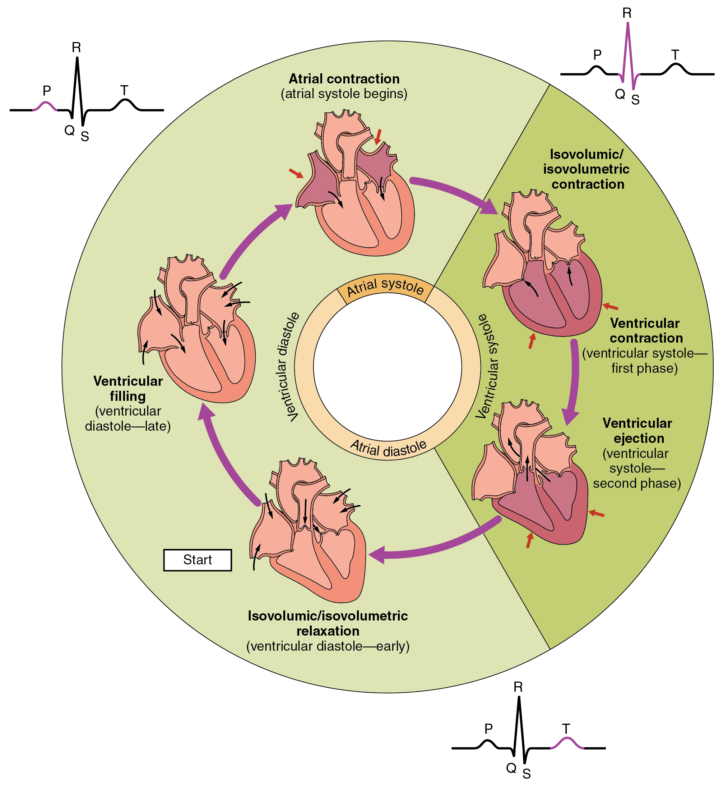

## Introduction
The heart is a key organ in the cardiovascular and circulatory system. It's main function within the body is to provide motion to the [[Blood| blood]] within the body. 

<figure>

<figcaption>Fig 1 - A Diagram of the Human Heart With Important Features Labelled</figcaption>
<a href="https://commons.wikimedia.org/wiki/File:Diagram_of_the_human_heart_(cropped).svg">Wapcaplet</a>, <a href="http://creativecommons.org/licenses/by-sa/3.0/">CC BY-SA 3.0</a>, via Wikimedia Commons
</figure>

The heart has 4 quadrants or chambers which are spaces which can be filled with blood. The superior 2 chambers are known as atria. The inferior 2 chambers are known as ventricles. An atrium's role is to provide blood to its respective ventricle. In order to do this there are passageways between the atrium and its respective ventricle known as atrioventricular valves or AV valves for short. These muscular chambers are used to move blood across the circulatory system.

## Coverings &  Layers
The heart is in the thoracic cavity of the body. Notably it has a dedicated covering known as the pericardium. The outer layer of this covering consisting of a mixture of dense and loose connective tissue is often referred to as the fibrous pericardium. It is dense with fibers such that it is tough and difficult to deform. It protects the heart from changes in pressure and from blunt trauma. The inner layer is a serous membrane. The outer or parietal layer of this covering is known as the parietal serous pericardium and lines the inside of the fibrous pericardium. The inner or visceral layer of the serous pericardium is tightly attached to the muscular layer of the heart. Indeed the visceral serous pericardium is often thought of as a layer of the heart called the epicardium. The muscular layer consisting of [[Cardiac Muscle]| cardiac muscle]] that the epicardium surrounds is called the myocardium. The layer that is inside the myocardium and thus lines the chambers of the heart is called the endocardium which consists of [[Epithelial Tissue| endothelium]].

### Summary of the Layers
#### Pericardial Covering
- Fibrous Pericardium - Dense and Loose Connective Tissue that protects the heart from blunt trauma and pressure changes
- Parietal Serous Pericardium - Mesothelium that coats the fibrous pericardium.
- Visceral Serous Pericardium - Mesothelium that directly surrounds the heart. Synonymous with the epicardium.
#### Layers of the Heart
- Epicardium - Mesothelium that surrounds the muscular layer of the heart
- Myocardium - Cardiac Muscle that the heart primarily consists of
- Endocardium - Endothelium that coats the inside of the chambers of the heart

## Cardiac Cycle
The muscles of the heart are constantly active. They pump blood from and to the rest of the body.

<figure>

<figcaption>Fig 2- The Cardiac Cycle</figcaption>
<a href="https://commons.wikimedia.org/wiki/File:2027_Phases_of_the_Cardiac_Cycle.jpg">OpenStax College</a>, <a href="https://creativecommons.org/licenses/by/3.0">CC BY 3.0</a>, via Wikimedia Commons
</figure>

